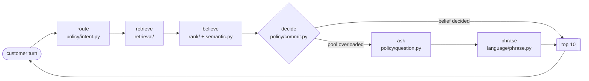

<div align="center">

# Conversational Shopping Agent

**TikTok TechJam 2026 · Problem Statement 4**
*Shopping Copilot: AI Conversational Search and Recommendations*


</div>

A shopper arrives without knowing exactly what they want. This agent finds the one product
they will buy, out of a frozen 50,000 item Amazon catalog, by holding a conversation and
asking for the detail that narrows the field fastest. It has ten turns at most, it runs
entirely in memory, and it needs no network access while it is being scored.

| | Ours | Organiser baseline |
| :--- | ---: | ---: |
| **TechnicalScore** | **0.893583** | 0.1067 |
| Coverage, HitRate@10 | 0.975 | 0.125 |
| Precision, MRR | 0.7796 | 0.068 |
| Efficiency | 0.861 | 0.119 |
| Mean turns to conversion | 2.39 | 9.81 |

| scenario | n | hit@10 | mrr | mttc |
| :--- | ---: | ---: | ---: | ---: |
| buying | 80 | 0.975 | 0.828 | 1.98 |
| browsing | 80 | 0.975 | 0.675 | 2.08 |
| intent_override | 30 | 0.967 | 0.917 | 4.03 |
| boundary | 10 | 1.000 | 0.817 | 3.30 |

> [!NOTE]
> Measured through the organiser's evaluator, unmodified, on all 200 public sessions. A fresh
> clone reproduces it, and the score is machine independent, verified across three Python and
> numpy combinations.

---

## Quick start

Python 3.11, 3.12 or 3.13.

```bash
pip install -r requirements.txt

cd techjam-conversational-search
python3 -m evaluator.local_evaluator --catalog data/catalog.jsonl
```

That is the official command, exactly as the organiser documents it. The frozen catalog is
committed at `techjam-conversational-search/data/catalog.jsonl`, so a clone is ready to run
with nothing to download.

<details>
<summary><b>Verifying the catalog, and the other checks worth running</b></summary>

The catalog is the organiser's file byte for byte, and the rules keep it read only:

```bash
cd techjam-conversational-search/data
wc -l catalog.jsonl      # 50000
sha256sum catalog.jsonl  # da979b05a68af864cb0dcf9ee6a81c010c7e66a57978ad286c7a2e005fc69a67
```

```bash
python3 -m pytest tests/ -q              # 97 tests
python3 evaluation/verify_offline.py     # a full session with every socket blocked
python3 evaluation/check_degeneracy.py   # proves popularity has not swallowed relevance
python3 evaluation/run_eval.py           # train split, per scenario, with latency and memory
```

`starter/agent.py` is a bridge that re-exports our implementation from `src/`, because the
evaluator hardcodes `from starter.agent import Agent`. The evaluator itself is unmodified,
and `tests/test_entry_point.py` pins SHA256 hashes of the evaluator files and the catalog so
an edit to either fails loudly.

</details>

---

## See it work

Real output from a real session, printed from the run traces. Each line carries the pillar of
the problem statement it answers.

```text
session public_0012    scenario: browsing

TURN 1  customer: I'm looking for Women Dresses, but I'm still exploring.
   I   route=browsing  pool=800
   II  pool_overloaded=True  asks=feature  pivot=False
   III belief_entropy=0.9211  retired=none  distilled=0.4727
   IV  target_rank=outside top 10

TURN 2  customer: For that, what matters is: Imported; Wrap closure.
   I   route=buying  pool=200
   II  pool_overloaded=False  asks=material  pivot=False
   III belief_entropy=0.8621  retired=none  distilled=0.4571
   IV  target_rank=1
```

The shopper opens without a target, so the router sends the turn down the Browsing track and
widens the candidate pool to 800. The pool comes back overloaded, which is the
over-generality condition in Pillar II, so the agent asks which feature matters rather than
returning a weak list. That answer moves the turn to the Buying track, the pool narrows to
200, and the target arrives at rank one.

On an Intent Override session the state machine detects the pivot and the target survives it:

```text
session public_0002    scenario: intent_override

TURN 2  customer: For that, what matters is: Imported; Buckle closure.
   II  pool_overloaded=True  asks=material  pivot=False
   IV  target_rank=3

TURN 3  customer: Actually, ignore my earlier preference. What I need is: leather.
   II  pool_overloaded=False  asks=color  pivot=True
   IV  target_rank=2
```

Reproduce both views with `python3 evaluation/run_eval.py --split train --traces
artifacts/traces.json`, then the two short scripts in `docs/demo-script-v2.md`.

---

## Architecture

One rule governs the layering: **language proposes, probability decides.** The language layer
holds no belief state and never chooses when to commit, because models are poorly calibrated
about their own confidence and calibration is the entire point of the ranking stage.



Six stages run every turn, and the shape of the pipeline is chosen per turn rather than fixed
at session start.

| Stage | Module | What it decides |
| :--- | :--- | :--- |
| route | `policy/intent.py` | Buying or Browsing, and the pipeline shape that follows |
| retrieve | `retrieval/baseline.py` | lexical candidates at the track's truncation width |
| believe | `rank/baseline.py`, `semantic.py` | retrieval score, popularity, phrase evidence and the offline LLM prior, blended into a distribution |
| decide | `policy/commit.py` | whether the pool is overloaded and whether the belief is decided enough to commit |
| ask | `policy/question.py` | which attribute buys the most information |
| phrase | `language/phrase.py` | the sentence, grounded in what the shortlist actually contains |

<details>
<summary><b>Why the belief is a separate object from the slots</b></summary>

The slots are the explicit constraints the customer stated. The belief is a distribution over
catalog items. They answer different questions: the slots say what was asked for, the belief
says how decided the answer is.

Nothing is ever hard filtered. A constraint demotes a non-matching item and always leaves it
in the pool, including candidates below the rerank depth, which are carried at the bottom of
the ranking. Amazon metadata has holes, and a filter that drops the target costs the whole
session with no way back.

The belief's shape turns out to predict the outcome, which was worth checking rather than
assuming. On the final turn of each session:

| outcome | n | median entropy | median peak share |
| :--- | ---: | ---: | ---: |
| hit at rank 1 | 110 | 0.9023 | 0.0889 |
| hit at rank 2 to 10 | 46 | 0.9112 | 0.0651 |
| missed | 4 | 0.9247 | 0.0641 |

Both measures order the three buckets correctly. `evaluation/self_evolution.py` recomputes it.

</details>

<details>
<summary><b>Repository map</b></summary>

```
src/
  agent.py          Entry class. Thin orchestration, owns the turn counter.
  interfaces.py     The four frozen seams between modules.
  config.py         Every tunable, in one dataclass, each with its measurement.
  catalog.py        Read-only loader for the frozen catalog.
  semantic.py       Reads the offline LLM appeal prior. Never raises.
  response.py       Contract-legal response construction and validation.
  trace.py          Per-turn traces.
  retrieval/        Lexical index, pooled and per-field, and query building.
  state/            belief.py the item distribution, slots.py accumulation,
                    override and decay, session.py the distilled context.
  policy/           intent.py dual-track routing, commit.py the over-generality
                    cutoff, question.py attribute selection.
  rank/             Reranking the shortlist into a belief.
  language/         phrase.py grounded question wording, rerank.py the optional
                    live LLM reranker, off by default.
offline/            Batches API pipeline that builds the semantic prior.
evaluation/         Eval wrapper, splits, sweep, offline rig, diagnostics and the
                    audits that put numbers on every claim in this file.
artifacts/          Derived tables and sweep results. Gitignored except the
                    committed semantic_prior.json.
docs/               Build plan, handoff, consolidation, findings, demo scripts.
```

</details>

---

## The four pillars

| Pillar | Requirement | Where it lives | Evidence |
| :--- | :--- | :--- | :--- |
| **I** | Dual-track routing, Buying against Browsing | `policy/intent.py` | 1.000 turn-one accuracy, `evaluation/intent_audit.py` |
| **I** | Multi-route retrieval, in memory, no external store | `retrieval/baseline.py` | pooled and per-field TF-IDF, both swept |
| **I** | LLM semantic ranking | `offline/build_semantic_prior.py`, `semantic.py` | model runs offline, result committed as an artefact |
| **II** | Dynamic state machine, information accumulation | `state/slots.py` | `tests/test_policy.py` |
| **II** | Intent Override, slot rewriting | `state/slots.py` `_pivot` | 30 of 30 sessions audited, `evaluation/override_audit.py` |
| **II** | Retrieval cutoff on over-generality | `policy/commit.py` | fires in 79 of 160 train sessions |
| **II** | Proactive structured clarification | `state/slots.py`, `language/phrase.py` | ask order set by measured yield, `evaluation/ask_yield.py` |
| **III** | Personalised context distillation | `state/slots.py` `to_query`, `state/session.py` | conversations distilled to 0.754 of raw length |
| **III** | Belief updated as evidence arrives | `state/belief.py` | mean entropy 0.896 across all turns |
| **III** | Runtime adaptation of its own guidance logic | `state/slots.py` `_exhausted` | an unproductive attribute retired in 23 sessions |
| **IV** | Coverage, precision, efficiency, per scenario | `evaluation/run_eval.py` | the tables above |
| **IV** | Generalisation beyond the tuning set | `evaluation/splits.py` | 40 held-out sessions, spent once, 0.8801 |

---

## Design decisions

Every decision below was measured on the 160 session train split. The held-out 40 were spent
once, at the end, and informed none of them.

<details>
<summary><b>The LLM ranking stage runs offline, and why</b></summary>

Pillar I quotes the pipeline base as "Multi-Route Retrieval then LLM Semantic Ranking", and
the submission rules say official scoring may run with network access disabled under CPU,
memory and timeout limits. Those pull in opposite directions, because a model on the critical
path becomes a way to score zero.

We resolved it by moving the model call off the turn path. `offline/build_semantic_prior.py`
sends catalog products to Claude Haiku 4.5 through the Batches API once, ahead of time, and
writes appeal and use-case judgments to `artifacts/semantic_prior.json`. That file is
committed. At scoring time the ranker reads it as a lookup, so an LLM judgment sits in the
shipped ranking while the graded run makes no network call and reports zero tokens.

Two honest qualifications. The artefact covers **60 of the 50,000 products**, a cost
controlled sample, and it moves the score by **0.0005** (0.893583 with it, 0.893083 without).
The full catalog pass is costed at about $13.44 and has not been spent, because the sample
has yet to show a direction worth scaling. This stage is a working pipeline demonstrated end
to end rather than a material contributor to the number.

A live conversational reranker also exists at `language/rerank.py`, reading the dialogue and
reordering the top 20. Every failure path returns the input order and reports
`used_llm=False`, so it can never cost a session. It is off by default because it has never
been run against a real key, which would cost $0.64 for a full 200 session run.

</details>

<details>
<summary><b>Constraints demote, they never filter</b></summary>

Pillar I asks the Buying track to "lock hard constraints". A literal lock deletes candidates,
and a filter that drops the target costs the entire session with no recovery, while a
demotion is recoverable three turns later. Amazon metadata has holes and the parent_asin
variant problem makes attribute values noisy even when present. So a violated constraint
sinks an item and nothing is ever removed, including the pool below the rerank depth.

</details>

<details>
<summary><b>Intent Override demotes rather than erases</b></summary>

The brief describes slot erasure. We demote instead, and that is measured rather than a soft
reading of the wording. In 28 of the 30 public `intent_override` sessions the preference the
customer says to ignore is itself lifted from the target product's own record and appears
verbatim in that product's text, so erasing it deletes true evidence.

| `override_demote` | behaviour | TechnicalScore | MRR |
| ---: | :--- | ---: | ---: |
| 1.0 | ignore the pivot entirely | 0.8951 | 0.790 |
| **0.5** | demote, the shipped behaviour | **0.8951** | 0.790 |
| 0.0 | literal slot erasure | 0.8925 | 0.782 |

Reproduce with `evaluation/override_audit.py`. The middle value implements the brief's intent
without paying for the literal reading.

</details>

<details>
<summary><b>Popularity carries real weight, and it is not degenerate</b></summary>

The single largest tuning win, worth about +0.21. Swept 0.0 to 5.0: the curve rises from
0.4608 at zero to a plateau near 0.743 between 1.5 and 3.0, then falls to 0.7176 at 5.0. We
ship 2.0, the middle of the plateau, because 1.5, 2.0 and 3.0 differ by less than 0.005 and
picking the argmax would fit noise on 160 sessions.

`evaluation/check_degeneracy.py` shows unrelated queries still return completely disjoint top
tens even at weight 20, because the prior only reorders a shortlist retrieval has already
filtered. The check is negative controlled, so it can actually fail.

</details>

<details>
<summary><b>The router is correct, and its decision does not change the output</b></summary>

This is the deviation we most expect to be asked about, so it is stated plainly. The
Buying and Browsing router scores 1.000 against the session label on turn one, and the tracks
do differ in retrieval width, 200 against 800. Both tracks then rerank to depth 200, so the
600 extra candidates a Browsing turn retrieves are discarded before anything reads them.
Sweeping `truncate_browsing` between 200 and 800 moves no metric, and zeroing
`intent_constraint_weight`, the router's heaviest input, moves no metric either.

Raising the Browsing rerank depth is what per-track configuration exists for, and it costs
0.011:

| `track_depth_browsing` | Score | HitRate@10 | MRR | MTTC |
| ---: | ---: | ---: | ---: | ---: |
| **200, shipped** | **0.8969** | 0.975 | **0.796** | 2.48 |
| 400 | 0.8858 | 0.975 | 0.752 | 2.37 |
| 800 | 0.8859 | **0.981** | 0.737 | 2.29 |

MRR carries 0.30 against Efficiency's 0.20, so trading 0.059 of MRR for 0.19 turns is a loss.
The optimal configuration gives both tracks the same depth.

The router stays because it is measured, because it is the seam any track-specific behaviour
attaches to at the cost of a config change, and because of the depth-800 row: HitRate reaches
**0.981**, the highest any configuration has produced. The wider pool genuinely holds targets
the narrow one misses, and nothing we have ranks them well enough to profit.

</details>

<details>
<summary><b>Field-aware retrieval is merged and switched off</b></summary>

A per-field TF-IDF route reached HitRate 0.988 in isolation, better than the pooled index's
0.975. Merged and swept across the full mixing range, field-aware scoring costs MRR
monotonically with no interior optimum, and route fusion added no recall the pooled route had
not already found.

The cause is mechanical. Per-field cosine normalises by that field's own length, so a product
whose short `store` field contains a query term scores near 1.0 on it while the same term is
diluted across a long description. That over-rewards short-field matches and crowds the top of
the list with plausible generics.

The code is merged, tested, and defaulted to zero weight. A field with weight zero is never
indexed, so it costs nothing at runtime. Full sweep in `docs/retrieval-merge-finding.md`.

</details>

<details>
<summary><b>Measured and rejected, so nobody rebuilds them</b></summary>

- **Profile preference-tags in the ranker.** Swept; a noise-band spike at one cell and
  monotonically negative with the full tag set.
- **Rarity-weighted phrases.** +0.0003, inside noise.
- **Three parser changes** that each read as obvious and each lost score: dropping "no
  additional preference" replies (0.7369 against 0.7422 for keeping them), deduplicating
  repeated phrases, and a narrower opening regex.

**Dense or vector retrieval was ruled out rather than measured**, and the distinction matters.
Phase 0 showed plain TF-IDF already reaches the target inside the top 1000 in 100% of sessions
once constraints are revealed, so there was no recall problem for embeddings to solve, and
every remaining miss is a ranking failure. Embedding weights would also need downloading,
which the offline scoring rule makes a liability.

</details>

<details>
<summary><b>Two requirements are genuinely absent</b></summary>

**Cross-session long-term profiling.** Pillar III asks for continuously updated long-term user
profiles. The rules define every session as an isolated single-user interaction with a fresh
`session_id`, so there is no eval surface for it. The supplied profile is treated as the
long-term state and distilled into the session, which is the most that is measurable here.

**The ask policy models the evaluator's constraint classifier.** Three of the ten legal
attributes can never be answered by this simulated customer, so we never ask them. That part
is fitted to this harness and a real deployment would need a general parser. The reliability
ordering itself, asking what the catalog can actually answer, would transfer.

</details>

---

## Evidence

### The held-out result

Forty of the 200 sessions were reserved on day one, stratified by scenario and seeded at
20260101. No tuning decision ever saw them. They were spent once, at the end, on the frozen
configuration.

| Split | n | TechnicalScore | HitRate@10 | MRR | MTTC |
| :--- | ---: | ---: | ---: | ---: | ---: |
| train, tuned on | 160 | 0.8969 | 0.975 | 0.796 | 2.48 |
| **held out, never seen** | **40** | **0.8801** | **0.975** | **0.712** | **2.05** |

The gap is **0.0168 and entirely MRR**. HitRate is identical on both splits, so nothing about
retrieval was fitted to the training sessions.

> [!IMPORTANT]
> This number is spent. It is honest because it was measured once, on a configuration frozen
> before the run. If a tunable changes after this point, the row stops describing the shipped
> system, and the right response is to say so rather than to re-run it.

### Where the remaining MRR goes

`evaluation/rank_diagnostics.py`, 160 train sessions:

| | |
| :--- | ---: |
| Mean rank of the target when retrieval returns it | 56.5 |
| Mean rank after ranking | **1.74** |
| Sessions where ranking promoted the target | 125 of 156 |
| Sessions where ranking demoted it | 2 |

When the target converts below rank one, the mean advantage held by the item above it is
popularity **+0.264**, appeal +0.008, rating +0.000, retrieval **-0.011**, phrase **-0.010**.
A negative figure means the target was ahead. So in the losing cases the target is equal or
better on the evidence that is about this customer, and it loses to the one signal that is
not. Per scenario the phrase advantage is exactly 0.000 every time.

The phrase signal has run out of resolution by the time a session is losing. That is the
measured case for a tie-breaker that fires only when phrase evidence ties, which is what the
live reranker is for.

### Where the score came from

| Change | Gain |
| :--- | ---: |
| Bridging the entry point, which the evaluator never reached | +0.435 |
| `weight_popularity` 0.15 to 2.0 | +0.21 |
| Ask policy ordered by measured attribute yield | +0.06 |
| `rerank_depth` 100 to 200 | +0.041 |
| Exact phrase overlap | +0.038 |

---

## Required disclosures

| | |
| :--- | :--- |
| Model | Claude Haiku 4.5, run offline through the Batches API to build `artifacts/semantic_prior.json`. The optional live reranker is configured for `claude-opus-5` and is off by default. |
| Cost per evaluation | $0.00. The offline artefact cost about $0.14 to build once. |
| Token usage | 0 prompt, 0 completion, reported as such in `usage` |
| Latency | 938 ms p95 per turn, 30 s one-off index build, measured on a shared cloud instance. The same commit runs the full 200 sessions in about 25 seconds on an Apple silicon laptop, so quote latency with the hardware beside it. |
| Memory | 964 MB peak across a 200 session run |
| Network | Not required. `evaluation/verify_offline.py` runs a ten turn session with every socket entry point poisoned, and is negative-controlled, so injecting a real socket call makes it fail. |

---

## Limitations

- The simulated customer's utterances are drawn verbatim from the target product's own catalog
  record, which we verified at 99.1% across all 200 sessions. Real shoppers paraphrase, so the
  lexical approach that works here would need semantic retrieval in production. This property
  comes from the evaluator's own code rather than from the public data, so it should hold on
  the private sessions too, though we cannot verify their harness.
- Browsing MRR is 0.675 against buying's 0.828 across half the sessions, and the held-out
  split reproduces the shape at 1.000 HitRate with 0.564 MRR. The agent finds the product and
  ranks it second.
- `intent_override` sessions cannot be won before turn 3 or 4 by construction, which puts a
  floor under MTTC that no policy can move.
- Slot decay reweights the ranking evidence rather than the retrieval query. Retrieval takes a
  plain string, and the only way to express a weight in a bag of words is repetition, which
  collides with the measured finding that a repeated phrase is already signal.
- The over-generality cutoff changes the shortlist depth and the question's framing. On this
  evaluator it cannot also withhold the recommendation list, because asking is free here and a
  withheld list is a thrown-away hit, so the part of Pillar II that reads as "do not answer,
  ask" is implemented as "do not answer widely, and ask".
- The belief's entropy feeds the intent router and never changes the routing decision on these
  200 sessions, because the opener and the constraint count decide everything else. It is kept
  as the tiebreaker for genuinely ambiguous turns that this simulator does not produce.

---
